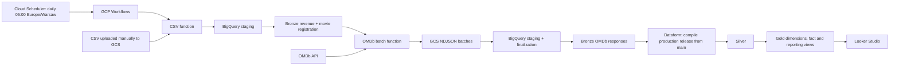
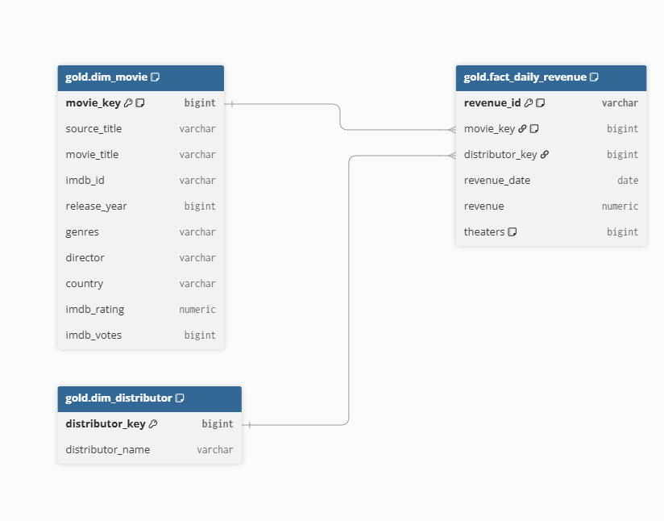

# FutureMind recruitment task - movie box office analytics

An end-to-end GCP pipeline that loads daily movie revenue from CSV, enriches movies
with OMDb metadata and builds a dimensional model for a three-page Looker Studio report.

## Architecture



Project: `PROJECT_ID`. BigQuery datasets are in `EU`; the configured
Dataform repository and Cloud Run functions are in `europe-west1`.
The diagram shows the orchestrated sequence; Dataform reads both Bronze tables.

## Repository structure

```text
assets/diagram.png       ER diagram of the implemented Gold model
workflow_settings.yaml          Dataform project, EU location and default datasets
definitions/
  sources/                      Declarations of existing Bronze tables
  silver/                       Clean revenue and latest successful OMDb metadata
  gold/                         Two dimensions, one fact and three reporting views
ingestion/
  csv_function/                 HTTP function: GCS CSV to BigQuery staging
  omdb_function/                HTTP function: assigned movies to a GCS NDJSON batch
  sql/tables/                   Bronze and operational table definitions
  sql/procedures/               Merge revenue, register movies, claim/finalize batches
  README.md                     Ingestion setup, contracts and recovery details
workflows/
  ingestion.yaml                Complete orchestration, including Dataform
  README.md                     Configuration, execution flow and failure handling
revenues_per_day.csv             Source dataset
```

The experimental notebook and quick OMDb check are on `testing_data`, not part of
production ingestion. Function folders contain their deployment dependencies in
`requirements.txt`. The CSV function also includes its required `revenue_load.json` schema.

## Data model



| Table | Grain / purpose |
|---|---|
| `bronze.revenue` | Latest source record by CSV id, with load metadata and movie ID |
| `bronze.omdb_responses` | One API attempt, including unsuccessful responses |
| `silver.revenue` | Revenue records with cleaned distributor names |
| `silver.movies` | Latest successful OMDb response per source movie ID |
| `gold.dim_movie` | Source movies successfully enriched from OMDb |
| `gold.dim_distributor` | Distinct cleaned distributors, including Unknown |
| `gold.fact_daily_revenue` | One record per source revenue id |

The fact and revenue tables retain daily dates but use monthly partitions, allowing
full historical loads without exceeding the per-job daily partition limit.
Movie attributes are current values, not slowly changing history. Source movie IDs
are hashes of title, first revenue date and first distributor. The current source
mapping groups by title and cannot automatically distinguish same-title remakes.

`dim_movie` intentionally excludes unmatched movies. Reporting preserves their revenue
with LEFT JOINs and a source-title fallback. Keys in the diagram are logical keys;
BigQuery constraints are not declared by the current SQLX definitions.

## Pipeline behavior

1. Upload the CSV manually to `gs://BUCKET_NAME/CSV_PATH/revenues_per_day.csv`.
2. Workflows generates a run ID and records execution in `ops.pipeline_runs`.
3. The CSV function loads a run-specific staging table. SQL validates and merges by
   source id, then registers movies and populates `bronze.revenue.source_movie_id`.
4. Batch allocation selects up to 50 pending/retryable movies. It reserves two API
   requests per film within both the run budget and the UTC-day budget of 900.
5. The OMDb function tries the estimated year, then the previous year only after
   a movie-not-found response. It writes all attempts to one NDJSON file per batch.
6. Workflows loads NDJSON to staging; finalization merges attempts into Bronze and
   updates movie and batch state. Successfully consumed staging tables are deleted.
7. After available work or the request budget is exhausted, Workflows compiles the
   Dataform `production` release, runs that exact compilation and waits for completion.
8. The run is marked succeeded or partial after Dataform succeeds, or failed on error.

Operational tables are `ops.pipeline_runs`, `ops.movie_fetch_control` and
`ops.omdb_batches`. There is no ingestion lock table. Only one execution should be
active; unfinished batches require manual recovery before a new run.

## Reporting

| Looker Studio page | BigQuery source |
|---|---|
| Overview: revenue trends, movie and distributor rankings | `gold.report_movie_revenue` |
| Single movie: metadata, daily revenue and theaters | `gold.report_movie_revenue` |
| Data quality filtered by revenue date | `gold.report_data_quality_daily` |
| Data quality for the whole dataset | `gold.report_data_quality_summary` |

Rankings use SUM(revenue) for the selected period. Theater counts, IMDb ratings and
IMDb votes must not be summed across days. Revenue currency and market coverage need
confirmation from the original dataset; the schema does not encode them.

The supplied CSV contains 337,818 records and 6,545 distinct titles, covering
2000-01-01 through 2023-03-06. There are 161 empty theater fields and 225 distributor
values equal to `N/A`; Silver treats the latter as missing distributors.

## Deployment and scheduling

1. Create `staging`, `bronze` and `ops` datasets in EU and execute the table/procedure
   SQL described in [the ingestion guide](ingestion/README.md). Existing schemas need
   explicit migration; CREATE TABLE IF NOT EXISTS does not update them.
2. Deploy both HTTP functions and inject `OMDB_API_KEY` from Secret Manager into
   the OMDb function. No API credentials are stored in this repository.
3. Connect Dataform to this Git repository and create the `production` release
   configuration pointing at `main`, with on-demand compilation.
4. Configure and deploy [the Workflow](workflows/README.md), then execute it manually.
5. Schedule the deployed Workflow through Cloud Scheduler with `0 5 * * *` and
   timezone `Europe/Warsaw`. A separate Dataform schedule is not needed.
6. Connect Looker Studio to the three Gold reporting views.

The user reported a successful end-to-end cloud execution. The current local files
must still be deployed when changed; Git commits alone do not replace GCP procedures,
functions or the Workflows definition. Cloud Scheduler setup is separate from this repo.
