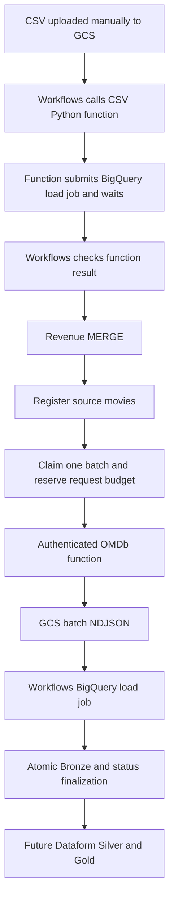

# GCP ingestion

Project: **futuremind-rekru-proj**. BigQuery location: **EU**.
Only `OMDB_API_KEY` comes from an environment variable, injected from Secret Manager.

This stage includes ingestion functions, BigQuery SQL and a local Workflow definition
at `workflows/ingestion.yaml`, extended to execute Dataform after ingestion.
A successful end-to-end GCP execution was reported during deployment. Changes to local
files must still be deployed explicitly to their corresponding services.

## Files

```text
ingestion/
  csv_function/          Deploy this folder: main.py, requirements.txt, revenue_load.json
  omdb_function/         Deploy this folder: main.py, requirements.txt
  sql/tables/            Bronze and operational table definitions
  sql/procedures/        Revenue merge, movie registration, batch allocation/finalization
  README.md              Configuration, deployment, data contracts and recovery
workflows/ingestion.yaml  Complete pipeline definition for the GCP YAML editor
```

There is no build or rendering step. SQL contains the actual project ID.
The CSV schema lives beside its function. OMDb staging inherits the Bronze schema
with `CREATE TABLE ... LIKE`; a second JSON schema is not needed.

## Processing

1. Upload CSV to `gs://futuremind_bucket/ravenue_data/revenues_per_day.csv`.
2. Workflows generates run_id and calls the CSV function.
3. The function loads CSV directly into staging; it never downloads the file locally.
4. SQL merges revenue by id, registers new source titles and drops CSV staging.
   register_movies also assigns source_movie_id to all Bronze revenue rows, using
   the same mapping as movie_fetch_control. Run Dataform only after registration succeeds.
5. SQL assigns up to 50 not-yet-downloaded movies to a batch.
6. The OMDb function tries the estimated release year, then the previous year only
   after Movie not found. Technical errors do not change the requested year.
7. All attempts are written to one NDJSON file, including errors for audit/status updates.
8. Workflows loads that file into OMDb staging. SQL merges by attempt_id and atomically
   updates movie/batch statuses. Staging is dropped after successful finalization.
9. Workflows continues with another batch until its budget or available work is exhausted.

Output: `gs://futuremind_bucket/batch_film_folder /<batch_id>.ndjson`.
The folder name has a trailing space, matching the supplied Console URL.
`ops.omdb_batches` stores file_name and the full file_uri.

## Workflow deployment values

Paste the entire `workflows/ingestion.yaml` into the GCP Workflows YAML editor.
The top of the file contains the supplied function URLs, Dataform region europe-west1,
repository futuremind-dataform-repository and execution service account. Verify these
values before deployment. The `production` release
configuration must exist and point to `main`, with BigQuery location EU in workflow_settings.yaml.
The Dataform repository region is separate from the BigQuery data location.

The Workflow creates a fresh compilation from this release, checks compilationErrors,
executes that exact result with all actions, and polls every 30 seconds until completion.
No separate Dataform workflow configuration or Dataform schedule is required.
Reaching the OMDb budget still proceeds to Dataform. SQL/HTTP failures stop execution.
The pipeline run is completed only after Dataform succeeds; Dataform failures are
recorded as failed in ops.pipeline_runs. Every execution gets a new run_id. There is no automatic resume or persisted Dataform
invocation checkpoint.

The Workflows identity needs permission to create compilation results, invoke Dataform,
read invocation status and act as the configured Dataform execution service account.
The execution account needs BigQuery job creation, source read and output write access;
configure the Dataform service agent to impersonate it as required by repository IAM.
Deploy the updated register_movies procedure and source_movie_id column before running.
Start manually with no input arguments first; configure the once-daily Scheduler trigger after validation.
Local YAML validation does not replace deployment validation or an end-to-end cloud run.

## Request limits and recovery

- Maximum planned requests per run: 900. An additional UTC-day cap is also 900.
- Allocation reserves two calls per movie; completed batches contribute actual counts.
  With only one request left, allocation stops conservatively.
- Executions accept no input arguments. run_id always comes from the execution ID.
  After a failure, inspect and manually resolve unfinished batches before the next run;
  restarting the workflow does not resume their assigned movies.
- Schedule the workflow once daily and ensure only one execution is active, including
  manual retries. There is no database lock preventing overlap. Recover a failed run
  before starting a new one; unfinished movie assignments and request reservations persist.
- OMDb reuses an existing final batch file. There are no per-movie checkpoints or GCS locks.
  A crash before file upload means a manual retry may repeat API requests. The counters
  cannot account for lost responses or other applications sharing the key.
- A failed load or SQL operation stops Workflows. Its staging remains for inspection,
  with seven-day expiration as a fallback. Original GCS files are retained.
- Cleanup is repeatable with DROP TABLE IF EXISTS. CSV retries reload the same staging table.
- Keep the source CSV unchanged during recovery. Object generations are not pinned.

## Setup and deployment

Enable the required GCP services. Prepare BigQuery manually in the GCP Console:

1. In project `futuremind-rekru-proj`, create datasets `staging`, `bronze` and `ops`
   with location `EU`.
2. Execute each SQL file from `ingestion/sql/tables/` in the BigQuery editor.
3. Execute each SQL file from `ingestion/sql/procedures/` in the BigQuery editor.

Existing datasets must also be in EU. The SQL creates missing tables and replaces
procedures; it does not migrate existing table schemas.
CSV columns must be in this order: id,date,title,revenue,theaters,distributor.
Revenue tables in Bronze, Silver and Gold use monthly date partitions. The historical
CSV spans more than 4,000 days, so writing all daily partitions in one job can fail.
Monthly partitioning preserves daily row granularity. Existing daily-partitioned tables
must be migrated or recreated; CREATE TABLE IF NOT EXISTS does not change partitioning.
Invalid IDs, dates or numbers fail before the revenue merge.

Deploy authenticated HTTP functions with Python 3.12 and a 1800-second timeout:

| Source folder | Entry point | Configuration |
|---|---|---|
| ingestion/csv_function | load_revenue_csv | No environment variables |
| ingestion/omdb_function | fetch_omdb | OMDB_API_KEY from Secret Manager |

Use concurrency 1 and max instances 1 for OMDb. Verify the settings at the
top of `workflows/ingestion.yaml` and deploy it. The workflow deployment region is separate
from the EU BigQuery location. Configure Cloud Scheduler separately if automatic scheduling
is required; no scheduler is created by this repository.

Permissions: CSV function needs BigQuery jobs, staging table access and GCS source read;
OMDb function needs BigQuery jobs, ops access, output object read/create and secret access;
Workflows needs function invocation, BigQuery jobs, table access including staging deletion,
and GCS output read. The bucket must be compatible with the BigQuery dataset location.

## Data and validation

Bronze preserves raw distributor markers and API JSON. loaded_at means first insertion;
revenue updated_at changes only when source values change. One exact CSV title identifies
one source movie, which cannot distinguish same-title remakes. Gold/Dataform are separate.

BigQuery procedures and Workflows still require integration testing in the target project.

## Architecture



## Data contracts

| Object | Grain / identity | Writer |
|---|---|---|
| staging.revenue_RUN_ID | CSV rows as STRING columns | CSV function BigQuery load job |
| bronze.revenue | Latest version of a revenue record / id | merge_revenue_batch |
| ops.movie_fetch_control | Earliest row per exact title / composite FARM_FINGERPRINT, INT64 | Registration, allocation, finalization |
| ops.omdb_batches | One batch / batch_id | Allocation, function, workflow, finalization |
| ops.pipeline_runs | One logical execution / run_id | Workflow |
| bronze.omdb_responses | One API attempt / attempt_id | Finalization |
| staging.omdb_RUN_ID | One batch's attempts, temporary | BigQuery load job |

Authoritative columns and types are in ingestion/sql/tables. All timestamps are UTC.
bronze.revenue.source_movie_id is populated by register_movies after the CSV merge.
For existing deployments, run ALTER TABLE `futuremind-rekru-proj.bronze.revenue`
ADD COLUMN IF NOT EXISTS source_movie_id INT64, replace the register_movies procedure,
then CALL `futuremind-rekru-proj.ops.register_movies`() to backfill existing rows.
Silver revenue reads this key directly; it must not recompute the movie identity.
bronze.revenue.source_file stores the full CSV GCS URI supplied as csv_uri, for example
`gs://futuremind_bucket/ravenue_data/revenues_per_day.csv`. It records the file that
inserted or last changed the row; unchanged rows retain their existing metadata.
ops.pipeline_runs.source_table still identifies the run-specific staging table for diagnostics.
For an existing bronze.revenue table, add source_file STRING before deploying the updated
procedure and workflow. Historical source_table values are staging names, not file URIs;
backfill source_file only from a known original file path, then drop the old source_table column.
The GCS object version is not pinned: keep the source unchanged when resuming a run. loaded_at means first Bronze insertion; updated_at means last change
of source revenue values. requested_at describes the external API attempt.

Each API attempt has payload JSON, outcome and is_final. Only one attempt per processed
movie is final within a batch. First-year not-found is retained if a second-year request
is made. outcome can be succeeded, not_found, needs_review, retry_pending,
quota_exceeded or configuration_error; the last two map to retry_pending in movie state.

source_movie_id is independent of matching year and IMDb identity. The current ingestion
assumes one source title represents one source movie. Gold keys and identity consolidation
will use INT64 in Dataform. Do not use a mutable estimated year as an identity key.
source_movie_id is FARM_FINGERPRINT of a JSON STRUCT containing title, first_revenue_date,
and first_distributor. The earliest row per exact title supplies all three
values; date ties are resolved by the STRING revenue id in ascending order. JSON preserves
NULL values and avoids separator ambiguity. first_distributor is stored
in the control table so the identity can be reconstructed.
Registration checks for hash collisions across incoming and existing composite identities.
This still groups by title and does not separate same-title remakes. A correction to the
selected row or arrival of an earlier row can create a new ID; existing control records
are not automatically reconciled. Changing the OMDb query year does not change the ID.
Deployments using the previous title-only or theaters-inclusive hash need a coordinated migration of control
records, Bronze responses and saved batch files before using this version. Adding the new
columns alone does not migrate existing identities. Do not resume old batches with new IDs.
Negative IDs are valid. Python preserves the integer in the batch NDJSON; OMDb staging
inherits its INT64 type from Bronze. run_id, batch_id and attempt_id remain STRING,
as does the external IMDb identifier.

Existing deployments with STRING source_movie_id require a coordinated data migration
before using this version: CREATE TABLE IF NOT EXISTS does not change existing types.
Existing batch files and staging tables with the old IDs cannot be resumed with this schema.

Source titles/distributor markers are not normalized in Bronze. Original OMDb payloads
are preserved except redaction of the configured credential if it is echoed upstream.

ops.omdb_batches stores file_name plus the full file_uri. It uses requests_used
as the single count of API attempts and NDJSON records; finalization
checks the loaded row count against it. For existing tables, the old redundant record_count
column can be dropped after updating the function and procedures.
The output prefix is `batch_film_folder ` (with a trailing space). Only the exact batch file is loaded.

Staging tables are dropped after successful consumption. On failure they remain
for diagnosis, with a seven-day expiry as a fallback. GCS source files are retained.

CSV schema: ingestion/csv_function/revenue_load.json. OMDb staging inherits the
Bronze table schema; loaded_at and source_uri remain NULL until Bronze finalization.
