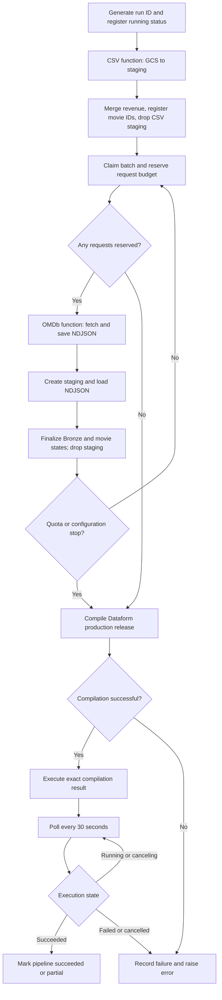

# Daily ingestion and Dataform orchestration

`ingestion.yaml` is the complete GCP Workflows definition. Paste its contents into
the YAML editor of the deployed workflow. It accepts no runtime arguments.

## Configuration

Settings are at the top of the YAML:

| Setting | Configured value / purpose |
|---|---|
| project | PROJECT_ID |
| csv_function_url | Deployed CSV Cloud Run function URL |
| omdb_function_url | Deployed OMDb Cloud Run function URL |
| dataform_region | europe-west1 |
| dataform_repository | DATAFORM_REPOSITORY_ID |
| dataform_release | production; must point to main |
| dataform_service_account | Account used to execute Dataform BigQuery actions |
| api_budget | 900 for both one run and the UTC day |
| batch_size | At most 50 films per batch |
| csv_uri | gs://BUCKET_NAME/CSV_PATH/revenues_per_day.csv |
| omdb_prefix | `batch_film_folder ` ? includes a trailing space |

BigQuery jobs use EU. The Dataform region is a service region, independent of the
BigQuery data location. URLs and service account identifiers are configuration, not secrets.
The OMDb key is injected into the function separately through Secret Manager.

## Execution flow

Other SQL or HTTP failures also enter the failure handler. Successful cleanup runs
only after the consuming SQL procedure finishes. BigQuery connector jobs are awaited;
Dataform compilation errors and execution status are checked separately.

`partial` means that pending, retry_pending or in_progress movies remain, even though
Dataform completed. It does not mean that Dataform failed. A quota/configuration stop
still persists the received API attempts and refreshes the available reporting data.

## Daily schedule

In GCP Workflows, choose Edit > Add new trigger > Cloud Scheduler:

- Frequency: `0 5 * * *`
- Timezone: `Europe/Warsaw`
- Arguments: leave empty
- Call logging: Errors only
- Authentication account: must have Workflows Invoker on the workflow

This schedules 05:00 Polish local time, including summer/winter time changes.
Scheduler creates the execution; its successful request does not prove the full pipeline
succeeded. Check Workflows execution status, ops.pipeline_runs and Dataform execution logs.
There is no separate Dataform workflow configuration or scheduled execution required.

## Permissions and prerequisites

- Workflows account: invoke both authenticated functions; submit BigQuery jobs;
  read/write ops and Bronze as needed by procedures; create/load/delete staging;
  read output GCS files; compile/invoke/read Dataform; act as its execution account.
- CSV function account: read the source object, submit BigQuery jobs and manage staging.
- OMDb function account: query/update ops, read/create batch objects and access its secret.
- Dataform execution account: BigQuery job creation, Bronze reads and Silver/Gold writes.
  Configure Dataform service-agent impersonation permissions for this account.
- Deploy the current SQL procedures, including the ROW_NUMBER-based batch limit and
  movie ID assignment. Revenue tables use monthly partitions.

## Failure and retry behavior

Each execution has a new run ID. The simplified workflow has no automatic resume mode
and does not reset movies left in_progress by an earlier failed batch. Inspect the batch,
its saved file, staging and movie assignments before starting another execution.
Do not blindly reset request counters or discard successfully downloaded responses.

Failed staging tables remain for diagnosis, with a seven-day expiration. GCS files
are retained. A crash before the batch file is saved can lose accounting for attempted
API calls; repeating those calls can consume additional quota. The budget also cannot
account for other applications using the same API key.

Run only one execution at a time, including manual retries. The once-daily schedule
is an operating assumption, not an overlap lock or an exactly-once guarantee.
